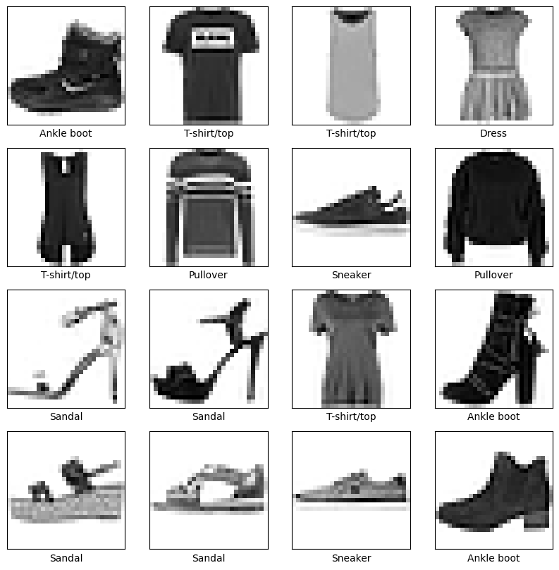
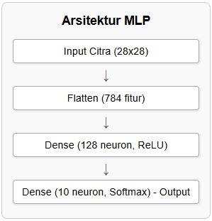
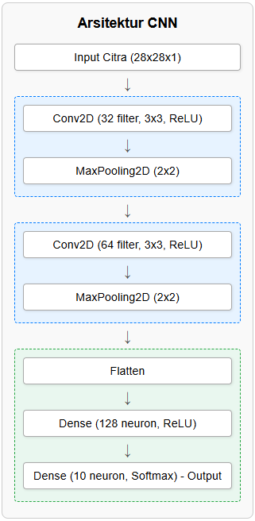
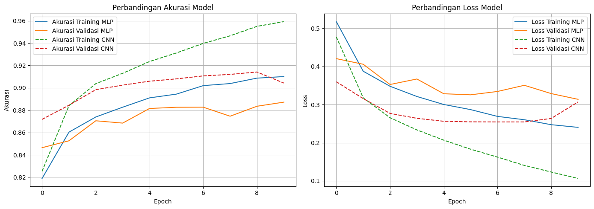
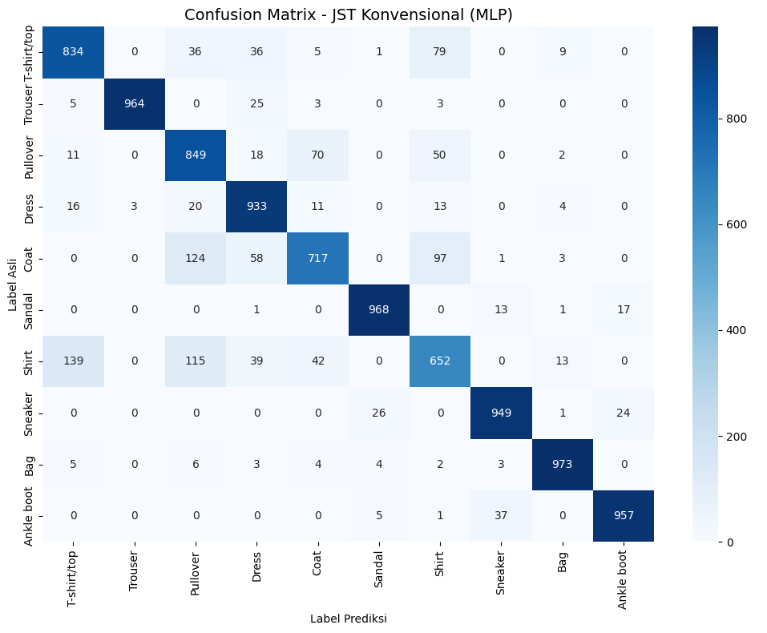
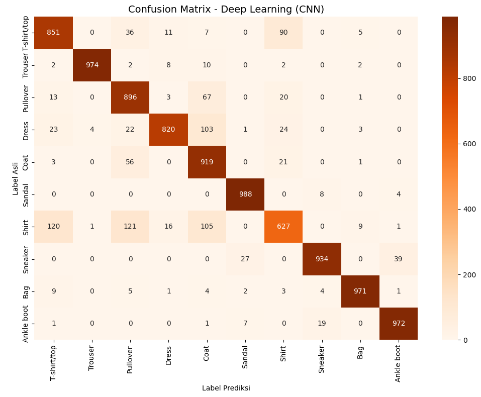
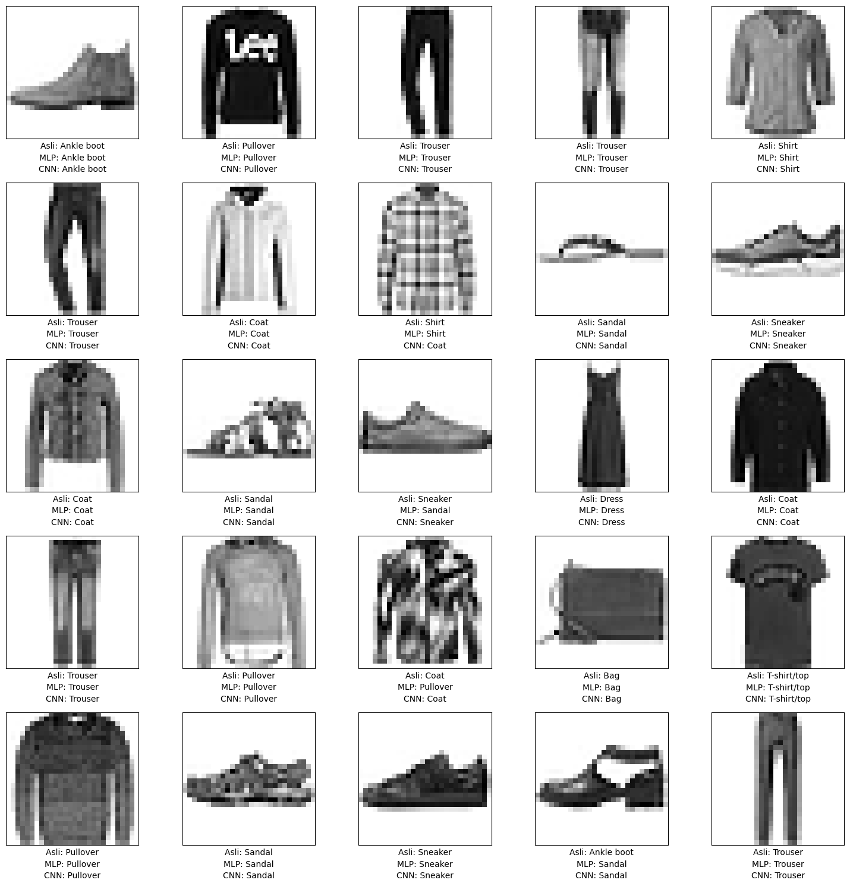

# 👕 Comparative Analysis: CNN vs. MLP for Image Classification

**Author:** Regan Agam (NIM: 24/PTK/552177/16439)[cite: 17]  
**Program:** Master's in Electrical Engineering, Universitas Gadjah Mada (UGM)[cite: 17]  
**Course:** Sistem Pembelajaran Dalam (Deep Learning Systems)[cite: 17]

## 📌 Project Overview
Image classification is a fundamental task in computer vision[cite: 17]. This project presents an empirical comparative analysis between two distinct neural network paradigms: a conventional Artificial Neural Network represented by a Multi-Layer Perceptron (MLP), and a specialized Deep Learning architecture, the Convolutional Neural Network (CNN)[cite: 17]. 

Using the Fashion-MNIST benchmark dataset (70,000 grayscale images of 28x28 pixels across 10 fashion classes), both models were implemented, trained, and evaluated to demonstrate the critical importance of architectural inductive bias in handling high-dimensional visual data[cite: 17].

## 📊 The Dataset: Fashion-MNIST
The dataset consists of 60,000 training images and 10,000 testing images categorized into: 'T-shirt/top', 'Trouser', 'Pullover', 'Dress', 'Coat', 'Sandal', 'Shirt', 'Sneaker', 'Bag', and 'Ankle boot'[cite: 17].



## 🛠️ Model Architectures

### 1. Multi-Layer Perceptron (MLP)
The MLP approach requires flattening the 28x28 input image into a 1D vector (784 features), which inherently destroys spatial information and topological relationships between pixels[cite: 17].
*   **Architecture:** Flatten -> Dense (128 neurons, ReLU) -> Dense (10 neurons, Softmax)[cite: 17]
*   **Total Trainable Parameters:** 101,770[cite: 17]



### 2. Convolutional Neural Network (CNN)
The CNN architecture is explicitly designed to process grid-like data. It exploits local connectivity and parameter sharing through convolutional kernels to automatically learn spatial feature hierarchies[cite: 17].
*   **Architecture:** 
    *   Block 1: Conv2D (32 filters, 3x3) -> MaxPooling2D (2x2)[cite: 17]
    *   Block 2: Conv2D (64 filters, 3x3) -> MaxPooling2D (2x2)[cite: 17]
    *   Classifier: Flatten -> Dense (128, ReLU) -> Dense (10, Softmax)[cite: 17]
*   **Total Trainable Parameters:** 225,034[cite: 17]



## 📈 Results & Comparative Analysis

Both models were trained using the Adam optimizer with Sparse Categorical Cross-Entropy loss for 10 epochs (using a 20% validation split)[cite: 17].

| Metric | MLP | CNN |
| :--- | :---: | :---: |
| **Test Accuracy** | 87.96% | 89.52% |
| **Macro Avg Precision** | 0.88 | 0.90 |
| **Macro Avg Recall** | 0.88 | 0.90 |
| **Macro Avg F1-Score** | 0.88 | 0.89 |
*(Data extracted from the evaluation on the 10,000-image test set).*[cite: 17]

### Training Dynamics & Convergence
The training graphs illustrate that the CNN model achieved more stable convergence within the 10 epochs. The MLP showed signs of potential overfitting, as validation loss began to stagnate or increase toward the end of training[cite: 17].



### Per-Class Efficacy (Confusion Matrices)
While both models struggled to differentiate visually similar classes like 'Shirt', 'T-shirt/top', and 'Coat', the CNN consistently outperformed the MLP across most categories. The CNN's ability to build feature hierarchies from simple edges to complex object parts proved advantageous[cite: 17].

<div style="display: flex; flex-direction: row; gap: 10px;">
  
  
</div>

### Visual Predictions
A qualitative comparison on 25 random test images highlights the CNN's superior consistency in predicting correct labels compared to the baseline MLP[cite: 17].



## 💡 Key Engineering Insights
1.  **Architectural Efficiency trumps Raw Capacity:** Despite having roughly 2.2 times more parameters (225k vs 101k), the CNN utilized them far more efficiently through parameter sharing. This underscores the Deep Learning principle that a well-designed inductive bias is more valuable than sheer model capacity[cite: 17].
2.  **The Necessity of Spatial Awareness:** The MLP's fundamental weakness lies in the flattening process, which discards spatial topology. The CNN's superior performance (89.52% vs 87.96%) directly results from its specialized design that preserves and exploits this vital spatial information[cite: 17].

## 🚀 How to Run
1. Clone this repository:
   ```bash
   git clone [https://github.com/yourusername/fashion-mnist-cnn-vs-mlp.git](https://github.com/yourusername/fashion-mnist-cnn-vs-mlp.git)
